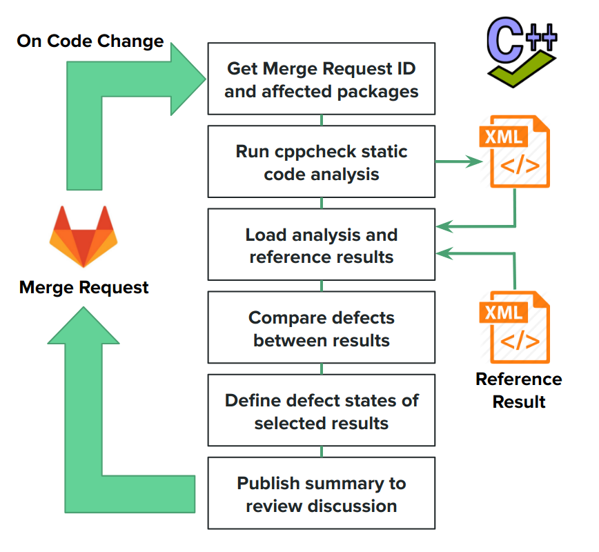

# Software Quality Analysis for the ATLAS experiment

This folder contains examples of some of the utilities created to help with the analysis of *software defects* present in the ATLAS offline software framework.

## Background

The software for the ATLAS experiment on the Large Hadron Collider at CERN has evolved over many years to meet the demands of Monte Carlo simulation, particle detector reconstruction and data analysis.  At present over **3.8 million** lines of C++ code (and close to **6 million** total lines of code) are maintained by an active worldwide developer community. To run the experiment software efficiently it is essential to maintain a high level of software quality standards.

Defects such as redundant code paths and errors of omission are often viewed as minor transgressions from the perspective of the individual developer and may not be flagged by compilers as part of the software build process. However if left unchecked the accumulation of defects invariably results in performance degradation at scale and leads to problems with the long-term sustainability of the software.

A wide range of software quality tools are used by the developer community in the ATLAS collaboration to identify, track and resolve any defects in their code. A limited selection of static code analysis tools (namely **cppcheck** and **Coverity**) are used to perform periodic scans across main development branches to provide scheduled notifications to code maintainers on any defects that require urgent resolution.  More general code quality indicators, coverage testing tools and code formatting checkers are also used as part of the development and build process.

## CI and Code review

Source code control is provided by *git*, thereby enabling the use of the *Gitlab* repository manager to provide a framework for code review (or merge requests) before any modifications are included in the main development branches. Any submitted merge request (or subsequent code modifications within the same merge request) triggers an ordered sequence of build correctness checking and unit testing jobs to be run by a continuous integration (CI) service.  A test result summary is then pushed to the Gitlab merge request discussion via the Gitlab Application Programming Interface (API). All test results are monitored by a dedicated rota of code review shifters to validate changes and to enforce experiment software guidelines before a merge request is accepted.

By extension, this framework can be leveraged to include the preemptive checking of defects by the addition of software quality tests within the CI test chain. Any new defects left unresolved after the code review can be attributed to the developer initiating the request and thus an audit trail of known defects is automatically provided.

### Continuous Software Quality

The software quality application *cppcheck* was used to generate a representative set of defect results within a CI test job. The illustrated workflow is shown below.

In studies it was found to be more beneficial to provide shorter feedback indicating a state change. Defects are either *introduced*, *removed* or remain *unresolved* against a reference result generated from the main development branch.

The summary report was constructed in a markdown syntax which could be parsed in a consistent format by *Gitlab*. An example report is shown below. Some care was taken in applying defect prioritisation and in truncating the report to a maximum length where necessary. Any defects introduced by the proposed code modification were given more prominence to motivate action to be taken and to halt further increases to the overall number of defects.

The scripts `CI-code-review/cppcheck-run.py` and `CI-code-review/cppcheck-report.py` run the defect checking service and generate the report for Gitlab respectively.

## Trend Analysis

Defect identification is only one aspect of an overall software quality evaluation strategy. Code quality indicators can also be used to signify the quality and relative maintainability of a given piece of software. Indicators can be relatively simple metrics (e.g the number of lines of code with comments) or more complex interpretations (e.g. function decision depth).

The application of code quality indicators within a CI framework was tested using the **Lizard** code quality tool, which provided a relatively fast method of generating several key quality indicator metric values for code contained in the main development branch. Reference results were converted into a JSON format and stored in an **Elasticsearch** index. Kibana was then applied to the curated dataset to provide a dashboard visualisation of indicator trends across successive versions of the code.

`analytics/lizard2ES.py` demonstrates how results on text format from *Lizard* were parsed and exported to a test *Elasticsearch* instance.

## Software Quality Dashboards

Trend analysis was also useful for generated domain-specific dashboards covering software defect trends using the *Coverity* application. Here, defect results in XML format were extracted from a remote database via the Coverity API and then transformed into a format suitable for export into *Elasticsearch*. Once imported this could then be used by dashboard tools (e.g. *Kibana*) to generate a customised view for developer groups. As well as providing a overview of open defects the dashbaord could be used to quickly generate historical trends and group defects by category and priority.

`analytics/lizard2ES.py` demonstrates how XML raw results from *Coverity* were parsed and exported to a test *Elasticsearch* instance.

## Further reading

- [Continuous software quality analysis for the ATLAS experiment
](https://indico.cern.ch/event/567550/contributions/2628872/) (18th International Workshop on Advanced Computing and Analysis Techniques in Physics Research, Seattle, USA)
